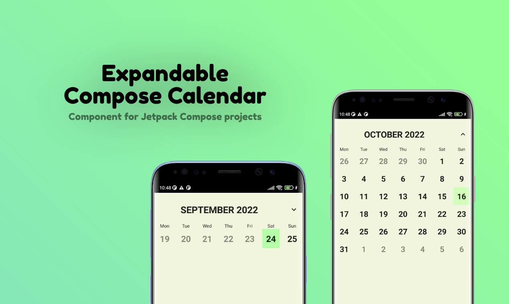

### Expandable Compose Calendar



Integrate calendar with your Jetpack Compose project.

[](https://github.com/mateusz800/Expandable-Compose-Calendar/actions/workflows/gradle.yml)
[](https://jitpack.io/#mateusz800/Expandable-Compose-Calendar)

### Introduction

A calendar with a week view that can be expanded to a month view

### Setup

1. Configure jitpack
2. Add the dependency

```gradle
dependencies {
  ...
  implementation 'com.github.mateusz800:Expandable-Compose-Calendar:ce5075e1d4'
  ...
}
```

### Usage

Add the `ExpandableCalendar` composable to your code:

```kotlin
ExpandableCalendar(onDayClick = {
    ...
})
```

#### Customization

`ExpandableCalendar` has an optional parameter named `theme`. By using this property you can
customize how your calendar will look like.
```kotlin
ExpandableCalendar(theme = calendarDefaultTheme.copy(
    // properties that you want to override
), onDayClick = {...})
```
 `CalendarTheme` data class looks like
```kotlin
data class CalendarTheme(
    val backgroundColor: Color,
    val headerBackgroundColor: Color,
    val dayBackgroundColor: Color,
    val selectedDayBackgroundColor: Color,
    val dayValueTextColor: Color,
    val selectedDayValueTextColor: Color,
    val headerTextColor: Color,
    val weekDaysTextColor: Color,
    val dayShape: Shape
)
```

### Support project

#### Contributing

Contributions are always welcome!

#### Show your support

Give a ⭐️ if this project helped you!
